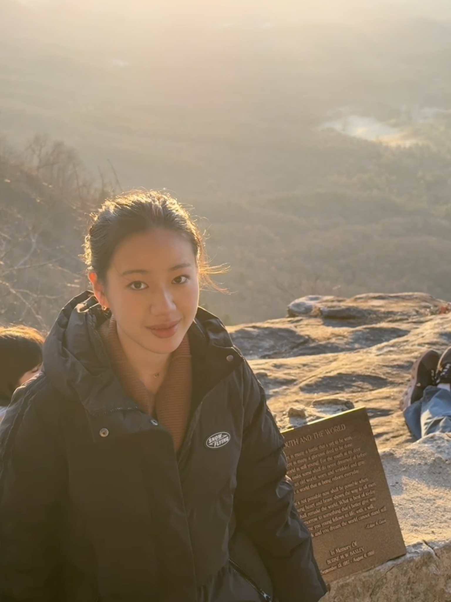

# Yutong (Natalie) Hu  

  

**Senior Undergraduate Student**  
Emory University  
**Major:** Computer Science | **Minor:** Applied Mathematics & Statistics  

My research interests primarily lie in **Natural Language Processing (NLP)**, where I have participated in several projects at the **Emory NLP Lab**. I also participated in **Computer Vision** projects in the healthcare domain. Looking ahead, I am eager to explore more **multimodal** research projects that integrate text, vision, and other modalities.

---

### Connect with Me

  <a href="https://www.linkedin.com/in/yutong-hu-natalie/" target="_blank">LinkedIn</a> •
  <a href="https://github.com/YutongHu-Natalie" target="_blank">GitHub</a> •
  Email: yutong.hu@emory.edu

