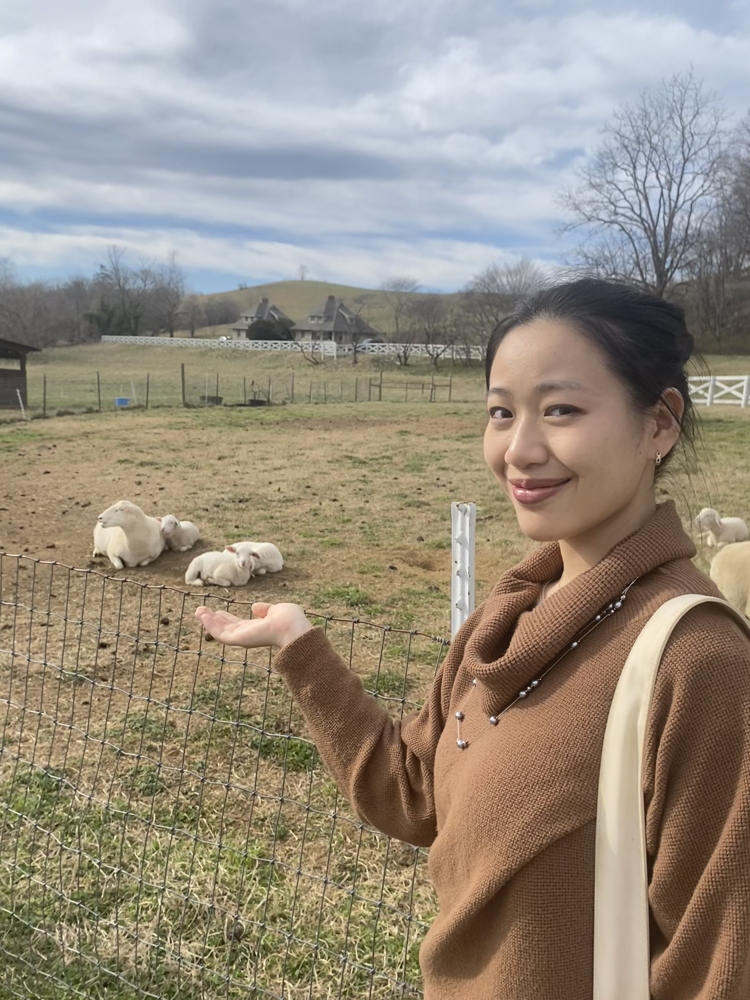

# Yutong (Natalie) Hu  

  

**MSCS Student**  
Emory University

**Major:** Computer Science | **Minor:** Applied Mathematics & Statistics  

I am a first-year M.S. student in Computer Science at Emory University, where I previously earned my B.S. in Computer Science with a minor in Applied Mathematics and Statistics.

My interests lie in Artificial Intelligence, particularly Natural Language Processing and intelligent agents. As a researcher in the Emory NLP Lab under the mentorship of Dr. Jinho Choi, I have gained experience deploying and fine-tuning open-source large language models and applying them to multidisciplinary research problems. I am especially interested in building human-centered AI systems that can better understand and interact with people.

I enjoy working in collaborative, interdisciplinary environments and value teamwork, communication, and continuous learning. I am also adaptable and eager to learn new technologies and skills when tackling new challenges.

---

### Connect with Me

  <a href="https://www.linkedin.com/in/yutong-hu-natalie/" target="_blank">LinkedIn</a> •
  <a href="https://github.com/YutongHu-Natalie" target="_blank">GitHub</a> •
  Email: yutong.hu@emory.edu

